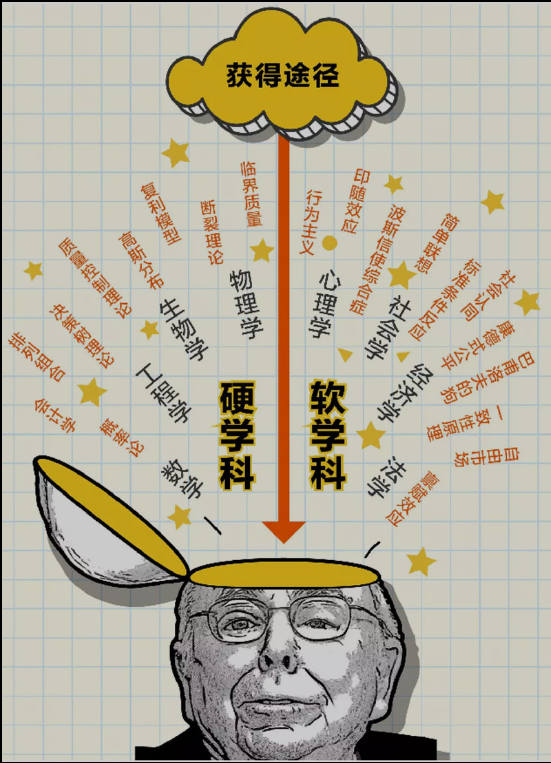

# 芒格的多元思维模型

查理·芒格的多元思维模型是一种跨学科的思考框架，旨在通过整合不同学科的重要理论和思维方式，帮助人们更全面、更深入地理解和解决问题。以下是关于芒格多元思维模型的核心内容和特点：

### 核心理念

- **多学科融合**：芒格认为，单一学科的知识往往不足以应对复杂多变的现实问题，因此需要从多个学科中汲取智慧。他强调掌握心理学、经济学、物理学、生物学、数学、工程学、哲学等不同领域的关键模型。

- **构建思维框架**：多元思维模型的核心是构建一个“思维模型的格栅”，即将不同学科的重要理论和思维方式整合到一个框架中。通过这种方式，人们可以将实际经验和间接经验（如阅读等）“悬挂”在这个框架上，从而形成一个系统的知识体系。

### 重要模型

芒格提出了许多重要的思维模型，以下是一些常见的例子：

- **复利模型**：强调长期积累和再投入的重要性。

- **机会成本**：在做决策时，要考虑到放弃的最有价值的替代方案。

- **博弈论**：用于分析竞争与合作环境中的最优策略。

- **熵增定律**：解释系统从有序到无序的演变趋势。

- **逆向思维**：通过思考如何避免失败来找到成功的路径。

### 应用价值

- **全面思考**：通过整合不同学科的思维方式，能够更全面地分析问题，避免因单一视角带来的局限。

- **提升决策质量**：帮助人们在复杂多变的环境中做出更明智的决策，减少因认知偏差和片面性导致的错误。

- **促进创新**：跨学科的思维方式能够激发新的想法和解决方案，推动个人和组织的创新。

### 实践建议

- **持续学习**：不断学习不同学科的知识，丰富自己的思维模型库。

- **灵活应用**：在面对问题时，尝试从多个角度思考，运用不同的思维模型。

- **反思与调整**：定期反思自己的思维方式，及时调整和优化思维模型。

总之，芒格的多元思维模型是一种强大的思考工具，能够帮助人们更好地应对复杂的世界，提升决策质量和创新能力。
