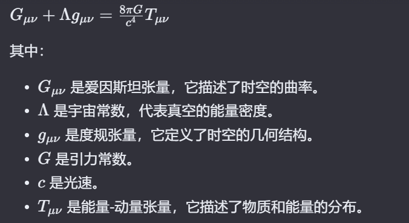

## 爱因斯坦场方程

爱因斯坦场方程是广义相对论中描述引力场的一个基本方程。它由阿尔伯特·爱因斯坦在1915年提出，用以描述时空的几何结构如何受到物质和能量的影响。方程的形式如下：

这个方程的左边代表了时空的几何性质，而右边代表了物质和能量的分布。方程表明，物质和能量的存在会导致时空的弯曲，而这个弯曲又决定了物质和能量的运动轨迹。简而言之，物质告诉时空如何弯曲，时空告诉物质如何运动。

爱因斯坦场方程在实际应用中有许多重要的例子，它们帮助我们理解和描述了宇宙中的许多现象。以下是一些关键的应用案例：

1. **水星近日点的进动**：爱因斯坦场方程能够解释水星轨道的近日点为何会逐渐偏移，这是牛顿引力理论无法解释的现象。这个现象的解释是广义相对论最早的成功预测之一。

2. **光线的引力偏折**：在强引力场中，如恒星或黑洞附近，光线的路径会因为时空的弯曲而发生偏折。这一现象在日食期间通过观测恒星光线的弯曲得到了验证。

3. **引力时间延迟**（也称为引力红移）：在强引力场中，时间会变慢，导致从强引力场发出的光的频率降低。这一效应已经在地球上的实验中被精确测量，并且对于全球定位系统（GPS）的精确运行至关重要。

4. **引力波**：爱因斯坦场方程预言了引力波的存在，这些是时空曲率中的涟漪，由加速的质量产生。2016年，LIGO科学合作组织和Virgo合作团队首次直接探测到了引力波，这一发现证实了广义相对论的这一重要预言。

5. **黑洞**：爱因斯坦场方程的解之一是史瓦西解，它描述了一个不旋转的黑洞周围的时空几何。这个解帮助我们理解了黑洞的性质，包括事件视界和奇点。

6. **宇宙的膨胀**：爱因斯坦场方程在宇宙学中的应用导致了弗里德曼-勒梅特-罗伯逊-沃尔克（FLRW）度规的发展，这是描述宇宙膨胀的数学模型的基础。

7. **引力透镜效应**：物质分布引起的时空弯曲可以像透镜一样弯曲光线，这导致了引力透镜效应，使得远处的天体在观察者看来被放大或扭曲。这一效应在天文学中被用来研究星系、黑洞和暗物质。

这些应用展示了爱因斯坦场方程在描述宇宙大尺度结构和强引力场现象方面的强大能力。通过这些方程，我们能够更深入地理解引力的本质，以及它如何塑造我们所在的宇宙。
