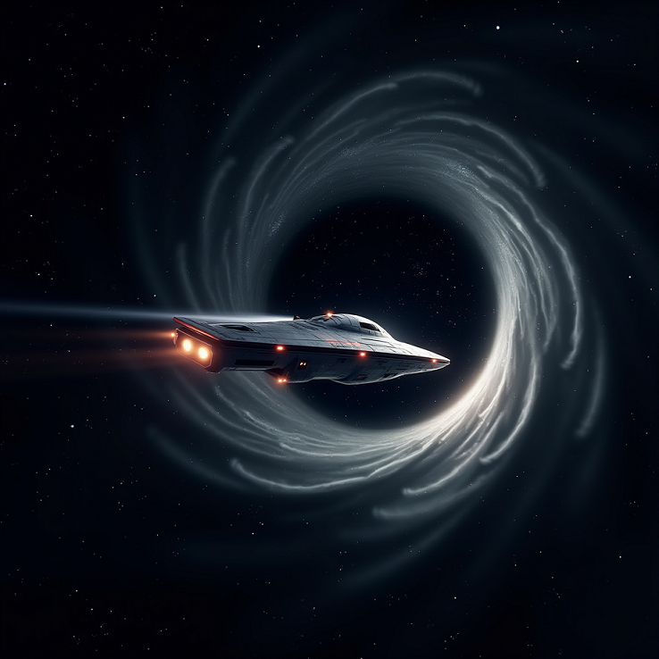

## 前往新家园X-24星球

Q

在遥远的未来，地球上的资源已经变得非常稀缺，人类开始向其他星球移民。嘟嘟是一个十岁的男孩，他的父亲是一名太空工程师，他们即将离开地球，前往一个名为X-24的遥远星球。

- **嘟嘟的房间：**

嘟嘟坐在地板上，周围是他的玩具和书，他的眼睛盯着窗外的星空。

**嘟嘟：** “爸爸，我们为什么要离开地球？我喜欢这里。”

**父亲（天明）：** “我知道这很难，嘟嘟。但地球已经没有足够的资源供我们所有人使用。我们必须去新地开始新生活。”

**嘟嘟：** “但我不想离开我的朋友和我的学校。”

天明坐在嘟嘟旁边，把手放在他的肩膀上。

**天明：** “我了解你的感受，嘟嘟。地球上的核燃料快用完了.我们得搬家了.我们的新家将安置在X-24星球上.你的朋友贾诺蒂一家已经搬到X-23星球了.我们的新家离那里不远.X-24是一个全新的世界，那里峡谷壮观,我们得感谢Xspace公司前期的探索,X-24星球的能源够我们再用1万年.”

嘟嘟的眼睛亮了起来，但他仍然有些犹豫。

**嘟嘟：** “那里会有学校和朋友吗？”

**天明：** “当然，那里会有来自银河系各地的孩子。你将有机会结交来自不同地方的新朋友。”

**嘟嘟：** “那你会和我们一起去吗？”

**天明：** “我保证，嘟嘟。我会一直在你身边。我们将一起乘坐我们中国航天局的太空飞船前往X-24，在那里一起建立我们的新家。”

嘟嘟沉默了一会儿，然后他抬头看着他的父亲，眼中充满了决心。

**嘟嘟：** “好吧，爸爸。如果我们一起，我想我准备好了。”

天明微笑着，紧紧拥抱了他的儿子。

几周后，嘟嘟和家人登上了前往X-24的太空飞船。虽然嘟嘟对离开地球感到难过，但他也对X-24可能带来的新奇和冒险感到兴奋。他紧紧握着父亲给他的一枚小陨石作为幸运符，这是他们在新世界开始新生活的象征。
