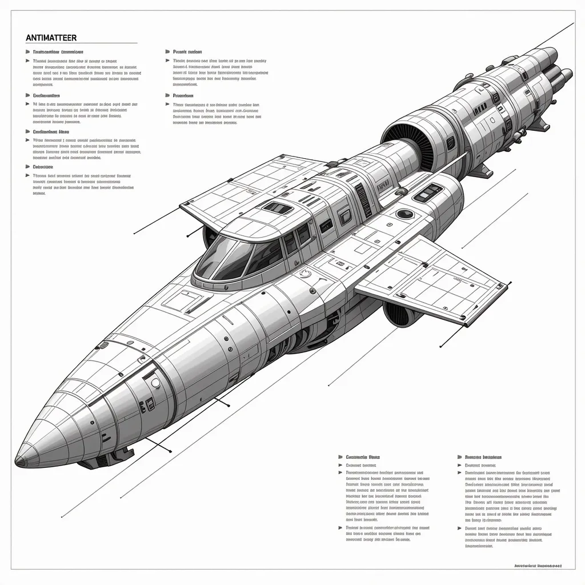

反物质飞船是一个科幻概念，同时也有实际的科学研究在探索其可能性。以下是关于反物质飞船的一些信息：

1. **科幻作品**：《反物质飞船》（SeeTee Ship）是杰克·威廉森的早期代表作，作为“反物质”系列中的一部，1942-1943年作品先在《惊奇故事》上连载，1951年以单行本的形式出版。小说中描述了主人公德雷克·瑞克为了寻求星际公司对其父亲的反物质研究项目的支持，留在了地球，并最终驾驶“再见，简”号飞船，踏上了探索反物质能源和平利用研究的危险之旅。

2. **科学研究**：美国宇航局先进理念研究所（NIAC）正在资助一个研究小组，该小组正致力于以反物质作为动力的太空船研究。反物质被认为是最具潜力的燃料，理论上，仅仅几十毫克的反物质就能帮助人类实现登上火星的梦想，而且只需要6周时间。反物质与物质相遇时会发生湮灭，转变为能量，这种能量变化遵循爱因斯坦的公式E=mc^2，使反物质成为最为高效的能源。

3. **技术挑战**：尽管反物质作为能源的潜力巨大，但目前面临几个技术挑战。首先是生产正电子的价格过于昂贵，据估计，以现在的技术为人类火星之旅生产正电子，每生产10毫克正电子将耗资约25亿美元。另一个挑战是如何在小型空间内储存足够的正电子，因为它们会吞食正常物质，而现在人类还没有生产出由反物质制成的容器，所以只能将其存放在电场、磁场、电磁场内。

4. **未来展望**：科学家们正致力于研究开发克服这些挑战的方法，假如他们的努力实现，也许未来人类真的可以借助科幻小说里描述的能源遨游太空。

综上所述，反物质飞船在科幻作品中是一个常见的主题，而在现实世界中，虽然科学家们正在探索其可能性，但目前仍面临着巨大的技术和经济挑战。
