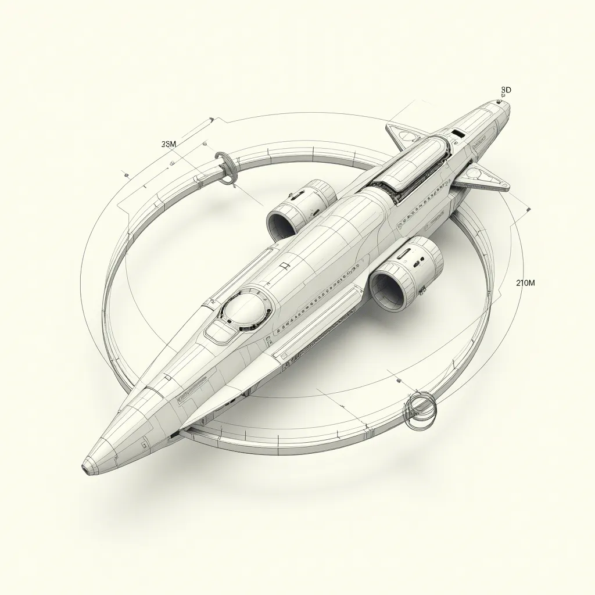
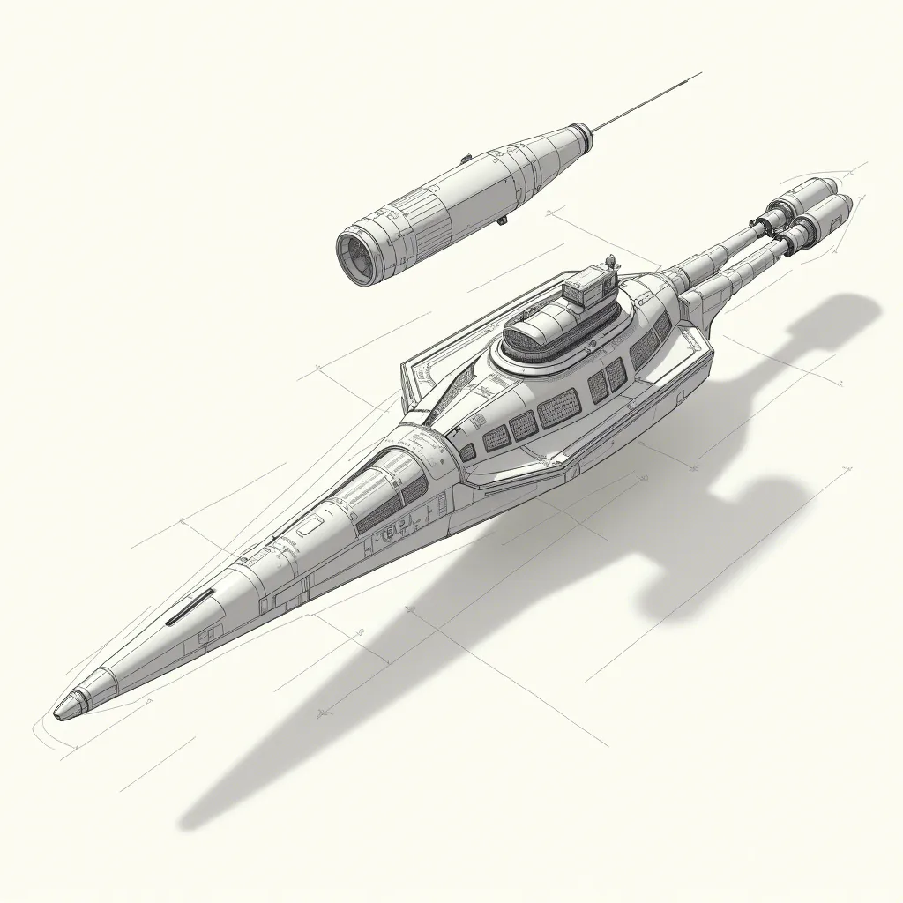

## 曲率引擎飞船

曲率引擎飞船是一种理论上的星际航行技术，它基于通过改变时空曲率来实现超光速飞行的概念。以下是关于曲率引擎飞船的一些关键信息：

1. **概念起源**：
   曲率引擎的概念最早由墨西哥物理学家米格尔·阿库别瑞（Miguel Alcubierre）在1994年提出。他提出了一种能够扭曲时空，造成飞船前方空间收缩，后方空间膨胀的“弯曲泡”，从而使飞船在不破坏相对论的情况下超光速飞行。

2. **物理原理**：
   曲率驱动的原理可以类比为在水中放入一块肥皂，降低后方水面张力，使得小船被前方较大的张力拉动。在宇宙中，如果能够减小飞船后方的空间曲率，飞船就会被前方曲率更大的空间拉过去。

3. **技术挑战**：
   实现曲率引擎需要一种尚未被发现的、具有负质量和呈负压的“特异物质”。此外，维持这种弯曲所需的能量超过了宇宙的总能量，且会产生大量威胁宇航员生命的辐射。

4. **最新研究**：
   近年来，有研究者提出了新的模型，展示了在现有物理学的基础上创建“曲率泡”的可能性，这可能使得曲率引擎飞船以非常接近光速的亚光速飞行。这项研究将传统和新型引力技术融为一体，提供了一种可能的实现方法，尽管具体实现仍然十分复杂且遥远。

5. **科幻与现实的桥梁**：
   曲率引擎飞船虽然起源于科幻作品，但科学家们一直在探索其科学基础和实现可能性。它代表了人类对于超越光速限制、实现星际旅行的渴望和探索。

综上所述，曲率引擎飞船是一种理论上的推进系统，它通过改变时空曲率来实现超光速飞行。尽管存在许多技术和物理上的挑战，但科学家们的研究为我们提供了实现这种科幻技术的可能性。
