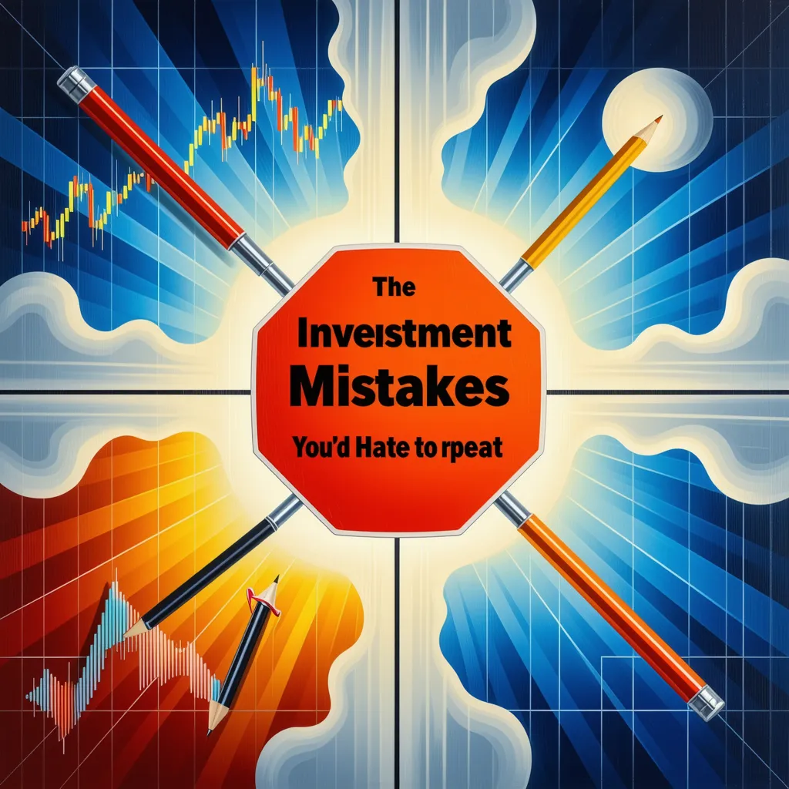

## 【投资避坑指南】四个你绝不想重蹈覆辙的错误



在投资的海洋中，每个人都是探险者，而那些最不想重犯的错误，就像是暗礁，一旦触碰，就可能造成巨大的损失。以下是四个投资者们普遍不愿再次经历的投资错误，让我们一起来认识它们，避免在未来的投资旅程中再次触礁。

```

```

#### **盲目跟风，缺乏独立思考**

- 投资市场上，总有一些声音在高呼“买这个”、“卖那个”。但盲目跟风，没有自己的独立判断，是投资者最常犯的错误之一。这种从众心理往往导致在市场高点买入，在低点卖出，最终造成损失。记住，投资决策应基于自己的研究和分析，而不是市场的喧嚣。

#### **过度杠杆，忽视风险管理**

- 杠杆是一把双刃剑，它可以放大收益，同样也能放大损失。许多投资者因为过度使用杠杆，而在市场波动时面临巨大风险，甚至可能导致爆仓。正确的做法是合理使用杠杆，同时制定严格的风险管理策略，确保投资安全。

#### **缺乏耐心，追求短期利益**

- 投资是一场马拉松，而不是短跑。许多投资者因为缺乏耐心，总是试图追逐短期利益，结果往往因为市场的短期波动而频繁买卖，不仅增加了交易成本，也错失了长期增值的机会。耐心持有，关注基本面，是实现长期投资回报的关键。

#### **信息闭塞，不持续学习**

- 市场是不断变化的，新的投资工具、策略和市场动态层出不穷。如果投资者停止学习，就会变得信息闭塞，无法适应市场的变化。持续学习，保持对市场动态的敏感性，是避免错误、抓住机遇的重要途径。

结语：

投资是一场智慧与耐心的较量，避免上述四个错误，就像是在这场较量中装备了盾牌和长矛。让我们以史为鉴，用智慧导航，耐心前行，在投资的道路上稳健前行，收获财富与智慧的双重回报。记住，投资不仅仅是关于赚钱，更是一种生活的智慧。

---

theme: The Four Investment Mistakes You'd Hate to Repeat  style: Modern illustrative style with an educational and cautionary tone, vivid colors to attract attention  lighting: Bright natural light to highlight the importance and urgency of the message  perspective: Aerial view, offering a holistic perspective to allow the audience to see the entirety of the "mistakes"  medium: Digital art, high definition suitable for screen display  environment/background: Abstract stock market background with charts and numbers, implying the complexity of the investment environment  composition: Central composition, four mistakes arranged around the central theme in the form of charts or symbols for easy identification and memory  adjectives: Cautionary, educational, eye-catching  details: Beside each mistake, there is a brief descriptive text, as well as tips on how to avoid these mistakes  emotion: Reflective and cautious, intended to inspire the audience to think deeply about investment decisions
