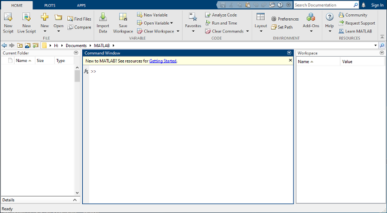
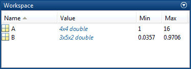
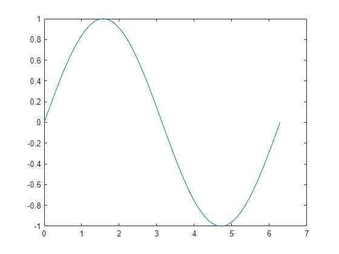
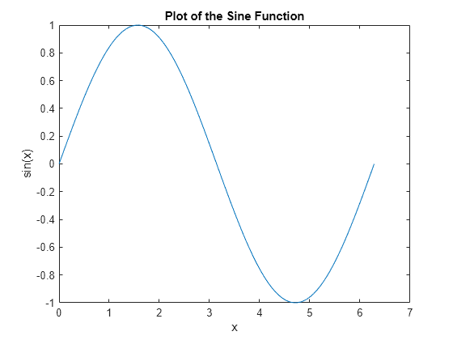
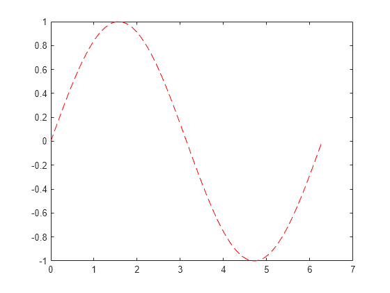
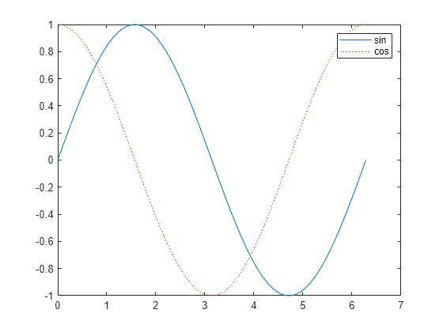
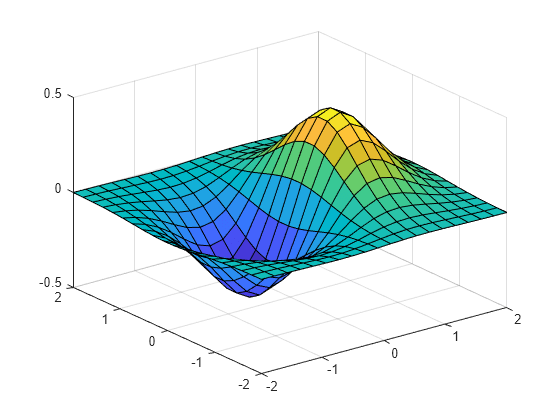
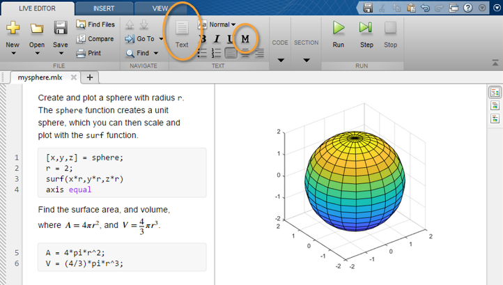

## MATLAB快速入门

科学计算语言 

## 桌面基础知识

启动 MATLAB® 时，桌面会以默认布局显示。



桌面包括下列面板：

- **当前文件夹** - 访问您的文件。

- **命令行窗口** - 在命令行中输入命令（由提示符 (`>>`) 表示）。

- **工作区** - 浏览您创建或从文件导入的数据。

使用 MATLAB 时，可发出创建变量和调用函数的命令。例如，通过在命令行中键入以下语句来创建名为 `a` 的变量：

`a = 1`

MATLAB 将变量 `a` 添加到工作区，并在命令行窗口中显示结果。

a = 
     1

创建更多变量。

`b = 2`

b = 
     2

`c = a + b`

c = 
     3

`d = cos(a)`

d = 
    0.5403

如果未指定输出变量，MATLAB 将使用变量 `ans`（*answer* 的缩略形式）来存储计算结果。

`sin(a)`

ans =
    0.8415

如果语句以分号结束，MATLAB 会执行计算，但不在命令行窗口中显示输出。

`e = a*b;`

按向上 (↑) 和向下箭头键 (↓) 可以重新调用以前的命令。在空白命令行中或在键入命令的前几个字符之后按箭头键。例如，要重新调用命令 `b = 2`，请键入 `b`，然后按向上箭头键。

# 

## 矩阵和数组

Open in MATLAB OnlineCopy Code  Copy Command

*MATLAB* 是“matrix laboratory”的缩写形式。MATLAB® 主要用于处理整个的矩阵和数组，而其他编程语言大多逐个处理数值。

所有 MATLAB 变量都是多维*数组*，与数据类型无关。*矩阵*是指通常用来进行线性代数运算的二维数组。

### 数组创建

要创建每行包含四个元素的数组，请使用逗号 (`,`) 或空格分隔各元素。

`a = [1 2 3 4]`

     1     2     3     4

这种数组为*行向量*。

要创建包含多行的矩阵，请使用分号分隔各行。

`a = [1 3 5; 2 4 6; 7 8 10]`

     1     3     5
     2     4     6
     7     8    10

您还可以用各个单独的代码行定义每行，并用换行符分隔各行。

`a = [1 3 5
     2 4 6
     7 8 10]`

     1     3     5
     2     4     6
     7     8    10

创建矩阵的另一种方法是使用 `ones`、`zeros` 或 `rand` 等函数。例如，创建一个由零组成的 5×1 列向量。

`z = zeros(5,1)`

     0
     0
     0
     0
     0

### 矩阵和数组运算

MATLAB 允许您使用单一的算术运算符或函数来处理矩阵中的所有值。

`a + 10`

    11    13    15
    12    14    16
    17    18    20

`sin(a)`

    0.8415    0.1411   -0.9589
    0.9093   -0.7568   -0.2794
    0.6570    0.9894   -0.5440

要转置矩阵，请使用单引号 (`'`)：

`a'`

     1     2     7
     3     4     8
     5     6    10

您可以使用 `*` 运算符执行标准矩阵乘法，这将计算行与列之间的内积。例如，确认矩阵乘以其逆矩阵可返回单位矩阵：

`p = a*inv(a)`

    1.0000    0.0000   -0.0000
         0    1.0000   -0.0000
         0    0.0000    1.0000

请注意，`p` 不是整数值矩阵。MATLAB 将数字存储为浮点值，算术运算可以区分实际值与其浮点表示之间的细微差别。使用 `format` 命令可以显示更多小数位数：

`format long
p = a*inv(a)`

```
0.999999999999996 0.000000000000007 -0.000000000000002
 0 1.000000000000000 -0.000000000000003
 0 0.000000000000014 0.999999999999995
```

使用以下命令将显示内容重置为更短格式

`format short`

`format` 仅影响数字显示，而不影响 MATLAB 对数字的计算或保存方式。

要执行元素级乘法（而非矩阵乘法），请使用 `.*` 运算符：

`p = a.*a`

     1     9    25
     4    16    36
    49    64   100

乘法、除法和幂的矩阵运算符分别具有执行元素级运算的对应数组运算符。例如，计算 `a` 的各个元素的三次方：

`a.^3`

           1          27         125
           8          64         216
         343         512        1000

### 串联

*串联*是连接数组以便形成更大数组的过程。实际上，第一个数组是通过将其各个元素串联起来而构成的。成对的方括号 `[]` 即为串联运算符。

`A = [a,a]`

     1     3     5     1     3     5
     2     4     6     2     4     6
     7     8    10     7     8    10

使用逗号将彼此相邻的数组串联起来称为*水平*串联。每个数组必须具有相同的行数。同样，如果各数组具有相同的列数，则可以使用分号*垂直*串联。

`A = [a; a]`

     1     3     5
     2     4     6
     7     8    10
     1     3     5
     2     4     6
     7     8    10

### 复数

复数包含实部和虚部，虚数单位是 `-1` 的平方根。

`sqrt(-1)`

ans = 
0.0000 + 1.0000i

要表示复数的虚部，请使用 `i` 或 `j`。

`c = [3+4i, 4+3j; -i, 10j]`

```
3.0000 + 4.0000i 4.0000 + 3.0000i
 0.0000 - 1.0000i 0.0000 +10.0000i
```

# 数组索引

Open in MATLAB OnlineCopy Code  Copy Command

MATLAB® 中的每个变量都是一个可包含许多数字的数组。如果要访问数组的选定元素，请使用索引。

例如，假设有 4×4 矩阵 `A`：

`A = [1 2 3 4; 5 6 7 8; 9 10 11 12; 13 14 15 16]`

     1     2     3     4
     5     6     7     8
     9    10    11    12
    13    14    15    16

引用数组中的特定元素有两种方法。最常见的方法是指定行和列下标，例如

`A(4,2)`

ans = 
14

另一种方法不太常用，但有时非常有用，即使用单一下标按顺序向下遍历每一列：

`A(8)`

ans = 
14

使用单一下标引用数组中特定元素的方法称为*线性索引*。

如果尝试在赋值语句右侧引用数组外部元素，MATLAB 会引发错误。

`test = A(4,5)`

`Index in position 2 exceeds array bounds (must not exceed 4).`

不过，您可以在赋值语句左侧指定当前维外部的元素。数组大小会增大以便容纳新元素。

`A(4,5) = 17`

     1     2     3     4     0
     5     6     7     8     0
     9    10    11    12     0
    13    14    15    16    17

要引用多个数组元素，请使用冒号运算符，这使您可以指定一个格式为 `start:end` 的范围。例如，列出 `A` 前三行及第二列中的元素：

`A(1:3,2)`

     2
     6
    10

单独的冒号（没有起始值或结束值）指定该维中的所有元素。例如，选择 `A` 第三行中的所有列：

`A(3,:)`

     9    10    11    12     0

此外，冒号运算符还允许您使用较通用的格式 `start:step:end` 创建等间距向量值。

`B = 0:10:100`

如果省略中间的步骤（如 `start:end` 中），MATLAB 会使用默认步长值 `1`。

---

## 工作区变量

*工作区*包含在 MATLAB® 中创建或从数据文件或其他程序导入的变量。例如，下列语句在工作区中创建变量 `A` 和 `B`。

`A = magic(4);
B = rand(3,5,2);`

使用 `whos` 可以查看工作区的内容。

`whos`

  Name      Size             Bytes  Class     Attributes
  A         4x4                128  double              
  B         3x5x2              240  double              

此外，桌面上的“工作区”窗格也会显示变量。



退出 MATLAB 后，工作区变量不会保留。使用 `save` 命令保存数据以供将来使用，

`save myfile.mat`

通过保存，系统会使用 `.mat` 扩展名将工作区保存在当前工作文件夹中一个名为 MAT 文件的压缩文件中。

要清除工作区中的所有变量，请使用 `clear` 命令。

使用 `load` 将 MAT 文件中的数据还原到工作区。

`load myfile.mat`

---

## 文本和字符

### 字符串数组中的文本

当您处理文本时，将字符序列括在双引号中。可以将文本赋给变量。

`t = "Hello, world";`

如果文本包含双引号，请在定义中使用两个双引号。

`q = "Something ""quoted"" and something else."`

q = 
    "Something "quoted" and something else."

与所有 MATLAB® 变量一样，`t` 和 `q` 为数组。它们的*类*或数据类型是 `string`。

`whos t`

  Name        Size            Bytes  Class     Attributes
  t           1x1               174  string   

要将文本添加到字符串的末尾，请使用加号运算符 `+`。

`f = 71;
c = (f-32)/1.8;
tempText = "Temperature is " + c + "C"`

tempText = 
"Temperature is 21.6667C"

与数值数组类似，字符串数组可以有多个元素。使用 `strlength` 函数求数组中每个字符串的长度。

`A = ["a","bb","ccc"; "dddd","eeeeee","fffffff"]`

A = 
  2×3 string array
    "a"       "bb"        "ccc"    
    "dddd"    "eeeeee"    "fffffff"

`strlength(A)`

ans =
     1     2     3
     4     6     7

### 字符数组中的数据

有时，字符表示的数据并不对应到文本，例如 DNA 序列。您可以将此类数据存储在数据类型为 `char` 的字符数组中。字符数组使用单引号。

`seq = 'GCTAGAATCC';
whos seq`

  Name      Size            Bytes  Class    Attributes
  seq       1x10               20  char               

数组的每个元素都包含单个字符。

`seq(4)`

ans = 
    'A'

使用方括号串联字符数组，就像串联数值数组一样。

`seq2 = [seq 'ATTAGAAACC']`

seq2 =
    'GCTAGAATCCATTAGAAACC'

在 R2017a 中引入双引号来创建字符串之前编写的程序中，字符数组很常见。接受 `string` 数据的所有 MATLAB 函数都能接受 `char` 数据，反之亦然。

## 调用函数

MATLAB® 提供了大量执行计算任务的函数。在其他编程语言中，函数等同于*子例程*或*方法*。

要调用函数，例如 `max`，请将其输入参量括在圆括号中：

`A = [1 3 5];
max(A)`

ans = 
5

如果存在多个输入参量，请使用逗号加以分隔：

`B = [3 6 9];
union(A,B)`

     1     3     5     6     9

通过将函数赋值给变量，返回该函数的输出：

`maxA = max(A)`

maxA = 
5

如果存在多个输出参量，请将其括在方括号中：

`[minA,maxA] = bounds(A)`

minA = 
1

maxA = 
5

用引号将任何文本输入括起来：

`disp("hello world")`

hello world

要调用不需要任何输入且不会返回任何输出的函数，请只键入函数名称：

`clc`

`clc` 函数清空命令行窗口。

## 二维图和三维图

### 线图

要创建二维线图，请使用 `plot` 函数。例如，绘制在从 0 到 2π 的值组成的线性间距向量上的正弦函数：

`x = linspace(0,2*pi);
y = sin(x);
plot(x,y)`



可以标记轴并添加标题。

`xlabel("x")
ylabel("sin(x)")
title("Plot of the Sine Function")`



通过向 `plot` 函数添加第三个输入参量，您可以使用红色虚线绘制相同的变量。

`plot(x,y,"r--")`



`"r--"` 为*线条设定*。每个设定可包含表示线条颜色、样式和标记的字符。标记是在绘制的每个数据点上显示的符号，例如，`+`、`o` 或 `*`。例如，`g:*"` 请求绘制使用 `*` 标记的绿色点线。

请注意，为第一幅绘图定义的标题和标签不再被用于当前的图窗窗口中。默认情况下，每次调用绘图函数、重置坐标区及其他元素以准备新绘图时，MATLAB® 都会清空图窗。

要将绘图添加到现有图窗中，请使用 `hold on`。在使用 `hold off` 或关闭窗口之前，当前图窗窗口中会显示所有绘图。

`x = linspace(0,2*pi);
y = sin(x);
plot(x,y)
hold on`

`y2 = cos(x);
plot(x,y2,":")
legend("sin","cos")
hold off`



### 三维绘图

三维图通常显示一个由带两个变量的函数 z=f(x,y) 定义的曲面图。例如，对于给定的行向量和列向量 `x` 和 `y`，每个向量包含 [-2,2] 范围内的 20 个点，计算 z=xe−x2−y2 。

`x = linspace(-2,2,20);
y = x';
z = x .* exp(-x.^2 - y.^2);`

然后，创建曲面图。

`surf(x,y,z)`



`surf` 函数及其伴随函数 `mesh` 以三维形式显示曲面图。`surf` 使用颜色显示曲面图的连接线和面。`mesh` 生成仅以颜色标记连接线条的线框曲面图。

### 多个绘图

您可以使用 `tiledlayout` 或 `subplot` 在同一窗口的不同部分显示多个绘图。

`tiledlayout` 函数是在 R2019b 中引入的，该函数比 `subplot` 提供更多对标签和间距的控制。例如，在图窗窗口中创建 2×2 布局。然后，每当您要某个绘图出现在下一区域中时，请调用 `nexttile`。

`t = tiledlayout(2,2);
title(t,"Trigonometric Functions")
x = linspace(0,30);
nexttile
plot(x,sin(x))
title("Sine")
nexttile
plot(x,cos(x))
title("Cosine")
nexttile
plot(x,tan(x))
title("Tangent")
nexttile
plot(x,sec(x))
title("Secant")`


如果您使用的版本早于 R2019b，请参阅 [`subplot`](https://ww2.mathworks.cn/help/matlab/ref/subplot.html)。

## 编程和脚本

*脚本*是一种最简单的 MATLAB® 程序。脚本是一个包含多行连续的 MATLAB 命令和函数调用的文件。在命令行中键入脚本名称即可运行该脚本。

### 脚本

要创建脚本，请使用 `edit` 命令。

`edit mysphere`

该命令会打开一个名为 `mysphere.m` 的空白文件。输入代码，以创建一个单位球、将半径加倍并绘制结果图：

`[x,y,z] = sphere; 
r = 2;
surf(x*r,y*r,z*r)
axis equal`

接下来，添加代码以计算球的表面积和体积：

A = 4*pi*r^2;
V = (4/3)*pi*r^3;``

编写代码时，最好添加描述代码的注释。注释能够让其他人员理解您的代码，并且有助于您在稍后返回代码时再度记起。使用百分比 (`%`) 符号添加注释。

`% Create and plot a sphere with radius r.
[x,y,z] = sphere;       % Create a unit sphere.
r = 2;
surf(x*r,y*r,z*r)       % Adjust each dimension and plot.
axis equal              % Use the same scale for each axis. `

`% Find the surface area and volume.
A = 4*pi*r^2;
V = (4/3)*pi*r^3;`

将文件保存在当前文件夹中。要运行脚本，请在命令行中键入脚本名称：

`mysphere`

还可以使用编辑器中的**运行**按钮  运行脚本。

### 实时脚本

您可以使用*实时脚本*中的格式设置选项来增强代码，而不是以纯文本编写代码和注释。实时脚本有助于您查看代码和输出并与之交互，还可以包含格式化文本、方程和图像。

例如，通过选择**另存为**并将文件类型更改为 MATLAB 实时代码文件 (`*.mlx`)，将 `mysphere` 转换为实时脚本。然后，用格式化文本替换代码注释。例如：

- 将注释行转换为文本。选择以百分比符号开头的每一行，然后选择**文本**、。删除百分比符号。

- 重写文本以替换代码行末尾的注释。要将等宽字体应用于文本中的函数名，请选择 。要添加方程，请在**插入**选项卡上选择**方程**。



要使用 `edit` 命令创建新的实时脚本，请在文件名中包含 `.mlx` 扩展名：

`edit newfile.mlx`

### 循环及条件语句

在任何脚本中，您都可以定义按循环重复执行或按条件执行的代码段。循环使用 `for` 或 `while` 关键字，条件语句使用 `if` 或 `switch`。

循环在创建序列时很有用。例如，创建一个名为 `fibseq` 的脚本，该脚本使用 `for` 循环来计算斐波那契数列的前 100 个数。在这个序列中，最开始的两个数是 1，随后的每个数是前面两个数的和，即 *Fn* = *Fn-1* + *Fn-2*。

`N = 100;
f(1) = 1;
f(2) = 1;`

`for n = 3:N
    f(n) = f(n-1) + f(n-2);
end
f(1:10)`

运行该脚本时，`for` 语句定义一个名为 `n` 的计数器，该计数器从 3 开始。然后，该循环重复为 `f(n)` 赋值，`n` 在每次执行中递增，直至达到 100。脚本中的最后一条命令 `f(1:10)` 显示 `f` 的前 10 个元素。

ans =
     1     1     2     3     5     8    13    21    34    55 

条件语句仅在给定表达式为 true 时执行。例如，根据随机数的大小为变量赋值：`'low'`、`'medium'` 或 `'high'`。在本例中，随机数是在 1 和 100 之间的一个整数。

`num = randi(100)
if num < 34
   sz = 'low'
elseif num < 67
   sz = 'medium'
else
   sz = 'high'
end`

语句 `sz = 'high'` 仅在 `num` 大于或等于 67 时执行。

### 脚本位置

MATLAB 在特定位置中查找脚本及其他文件。要运行脚本，该文件必须位于当前文件夹或*搜索路径*中的某个文件夹内。

默认情况下，MATLAB 安装程序创建的 `MATLAB` 文件夹位于此搜索路径中。如果要将程序存储在其他文件夹，或者要运行其他文件夹中的程序，请将其添加到此搜索路径。在当前文件夹浏览器中选中相应的文件夹，右键点击，然后选择**添加到路径**。

## 帮助和文档

所有 MATLAB® 函数都有辅助文档，这些文档包含一些示例，并介绍函数输入、输出和调用语法。从命令行访问此信息有多种方法：

- 使用 `doc` 命令在单独的窗口中打开函数文档。
  
  doc mean

- 在键入函数输入参量的左括号之后暂停，此时命令行窗口中会显示相应函数的提示（函数文档的语法部分）。
  
  mean(

- 使用 `help` 命令可在命令行窗口中查看相应函数的简明文档。
  
  help mean

点击帮助图标  即可访问完整的产品文档。
