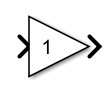
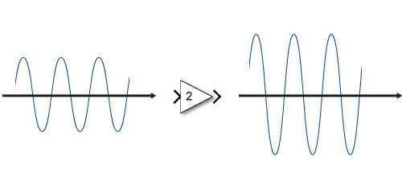
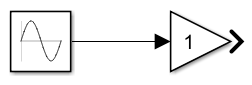
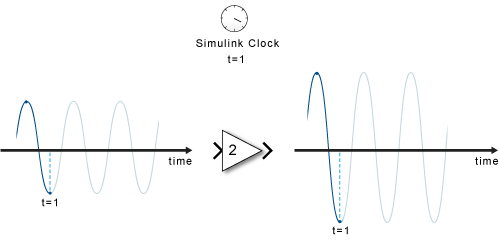
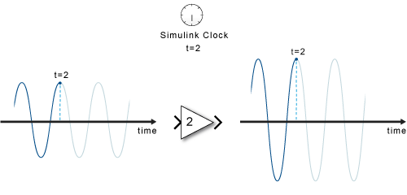

## Simulink 模块图

Simulink® 是动态系统的图形建模和仿真环境。您可以创建模块图，用模块表示系统的各个组成部分。模块可以表示物理组件、小型系统或函数。输入/输出关系则完整描述了模块特征。请思考下面这些示例：

- 一个水龙头往一个水桶里注入水 - 水以一定的流速进入水桶，水桶变重。模块可以表示水桶，水的流速为输入，水桶的重量为输出。

- 您用扩音器传递声音 - 扩音器一端产生的声音在另一端被放大。扩音器是模块，输入是声源的声波，输出是您听到的声波。

- 您推动购物车使它移动 - 购物车是模块，您施加的力是输入，购物车的位置是输出。

只有定义了输入和输出，模块的定义才算完成，并且此模型定义任务需与建模目的相关。例如，如果建模目的不涉及购物车的位置，则会自然选择购物车的速度作为输出。

Simulink 提供了一些模块库，它们是按功能分组的模块集合。例如，要对以常量倍数放大输入的扩音器进行建模，可以使用 Math Operations 库中的 Gain 模块。

进入扩音器的声波作为输入，出来的同一声波的更大版本作为输出。

**>** 符号表示模块的输入和输出，可以连接到其他模块。

您可以将模块连接到其他模块以构成系统，从而表示更复杂的功能。例如，音频播放器可将数字文件转换为声音。软件从存储中读取数字表示，以数学方式对其进行解释，然后将其变为物理声音。处理数字文件以计算声音波形的软件可以是一个模块，接收波形并将其转换为声音的扬声器可以是另一个模块。生成输入的组件又是另一个模块。

要在 Simulink 中对扩音器的正弦波输入进行建模，需要包含 Sine Wave 源。

Simulink 的主要功能是对系统各个组件随时间流逝的行为变化进行仿真。简单来讲就是：采用一个时钟，按时间确定各个模块的仿真顺序，并在仿真过程中依次将在上一个模块图中计算得出的输出传播到下一个模块，直至最后一个模块。以扩音器为例。在每个时间步，Simulink 都必须计算正弦波的值，将其传播给扩音器，然后计算输出值。

在每个时间步，每个模块都要根据输入计算输出。当在一个给定时间步计算完图中的所有信号后，Simulink 将基于模型配置和数值求解器算法确定下一个时间步，并向前移动仿真时钟。接下来，每个模块将为这个新的时间步计算输出。

在仿真中，时间的移动与真实时钟不同。完成每个时间步的计算需要多长时间，该时间步就会花费多长时间，而不管它代表几分之一秒还是几年。

通常，组件的输入对其输出的影响不是瞬时的。例如，打开加热器不会导致温度立即发生变化。该动作为微分方程提供输入。历史温度（一个*状态*）也是一个输入因子。当仿真需要求解微分方程或差分方程时，Simulink 使用内存和数值求解器来计算时间步的状态值。

Simulink 处理三类数据：

- 信号 - 在仿真期间计算的模块输入和输出

- 状态 - 在仿真期间中计算的代表模块动态的内部值

- 参数 - 影响模块行为的值，由用户控制

在每个时间步，Simulink 都计算信号和状态的新值。相比之下，您可以在编译模型时指定参数，并且可以在仿真运行时偶尔更改它们。

## 相关主题
