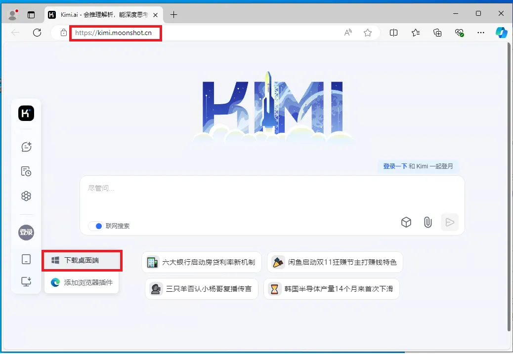
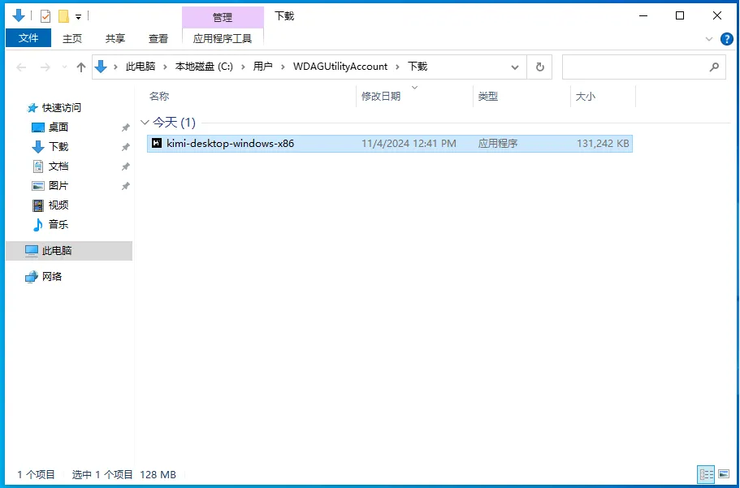
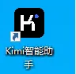
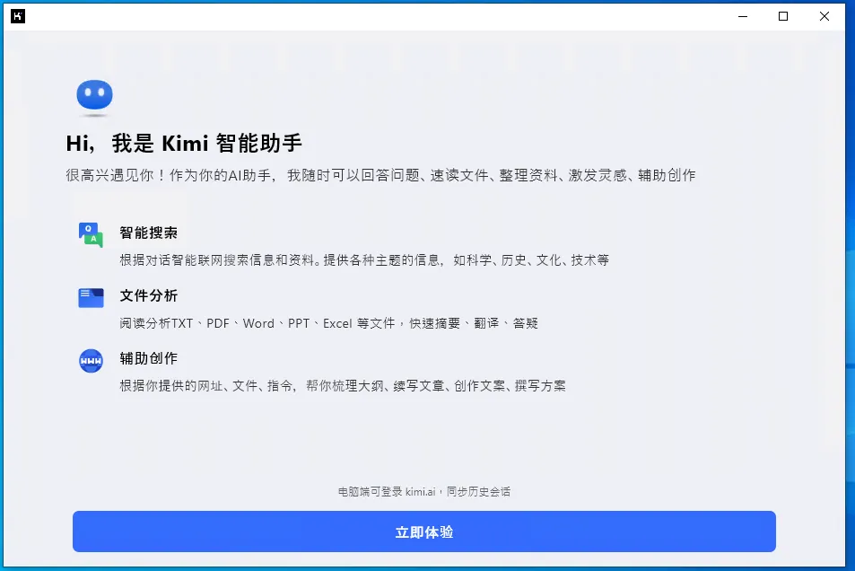
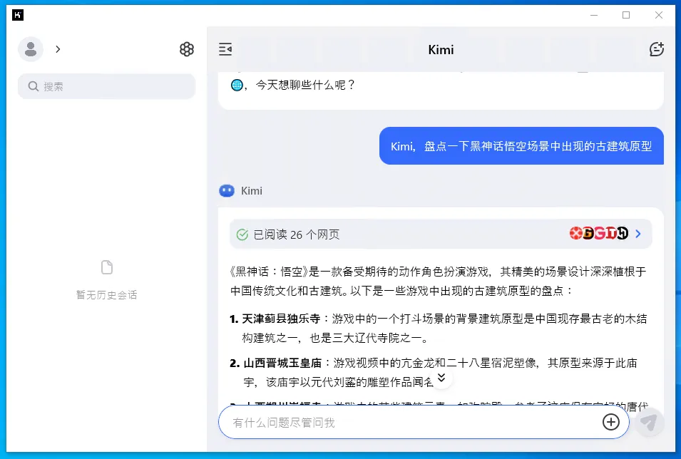

# Kimi安装指南（Windows版）

## 1. 系统要求

- **操作系统**：Windows 7/8/10/11（32位或64位）
- **内存**：至少2GB RAM
- **硬盘空间**：至少500MB可用空间
- **网络连接**：需要稳定的网络连接以访问Kimi服务

## 2. 安装步骤

### 步骤1：下载Kimi应用程序

1. 访问Kimi官方网站：[Kimi官方网站](https://kimi.moonshot.cn)。

2. 在网站上找到适用于Windows的Kimi应用程序下载链接。

3. 点击下载并保存安装文件到您的计算机上。*
   
   

### 步骤2：安装Kimi应用程序

1. 双击下载的安装文件以启动安装程序。

2. 按照安装向导的指示进行操作。
   
   - 接受许可协议。
   - 选择安装路径（默认路径或自定义路径）。
   - 点击“安装”按钮开始安装过程。

3. 安装完成后，点击“完成”按钮结束安装向导。
   
   

### 步骤3：启动Kimi应用程序

1. 点击“开始”菜单，找到Kimi应用程序。

2. 点击Kimi图标启动应用程序。

3. 如果是第一次运行，可能需要进行一些初始设置，如登录或创建账户。
   
   

### 步骤4：更新Kimi应用程序

1. Kimi应用程序会定期检查更新。

2. 如果有可用的更新，应用程序会自动下载并提示您安装。

3. 您也可以手动检查更新，方法是点击应用程序内的“帮助”菜单，然后选择“检查更新”。
   
   **[更新Kimi应用程序的图片占位符]**

## 3. 使用Kimi

- 启动Kimi后，您将看到一个用户界面，您可以在这里输入问题或请求。

- Kimi会以对话的形式回应您的问题。

- 您可以通过文本输入与Kimi互动，Kimi会提供信息、解答疑问或执行指定的任务。
  
  
  
  

## 4. 故障排除

- 如果安装过程中遇到问题，请确保您的Windows系统更新到最新版本。
- 如果Kimi应用程序无法启动，请检查您的防火墙或杀毒软件设置，确保它们没有阻止Kimi应用程序。
- 如果您遇到任何技术问题，可以访问Kimi的帮助中心或联系客服获取支持。

## 5. 卸载Kimi

- 您可以通过Windows的“控制面板”中的“程序和功能”来卸载Kimi。
- 选择Kimi应用程序，然后点击“卸载”按钮。
- 按照提示完成卸载过程。