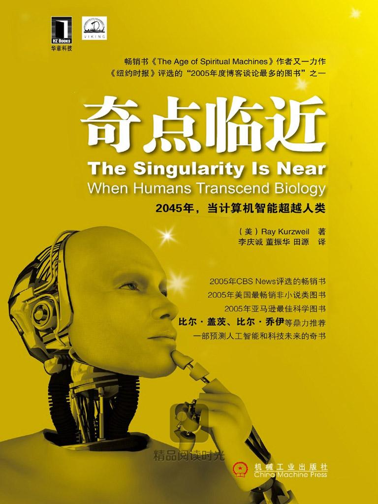

# 雷·库兹韦尔的奇点临近

---

雷·库兹韦尔在《奇点临近》这本书的主要有一下观点：

1. **奇点概念**：书中探讨了“奇点”这一概念，即**技术发展超越人类理解的阶段**。这个概念让人们对技术突飞猛进可能带来的无法预测的变革充满期待和担忧。
2. **技术指数增长**：雷·库兹韦尔认为，摩尔定律会让技术呈指数级增长，人类会在2045年到达奇点，届时计算机的运算速度和智能将远超人类。
3. **人类与技术的融合**：书中提出了“精神拷贝”的概念，即通过将人的意识和记忆转移到计算机中，实现人的意识的永久存储和延续。同时，作者也探讨了机器与人类融合的可能性，引发了关于人类身份和个性的讨论。
4. **人类进化和超越**：库兹韦尔在书中讨论了人类和机器融合后，如何催化人类的进化和超越传统的人类限制。
5. **未来社会的经济、政治、道德和伦理问题**：作者就未来社会的经济、政治、道德和伦理问题进行了思考和探讨。他认为，随着技术的进步，我们需要重新思考和重新定义人类的价值观和道德准则。
6. **基于幸福度的成功定义**：提出了一些想法，如基于幸福度而非物质财富来定义成功，以及我们如何保护个人隐私和数据安全等。
7. **技术进步与通胀关系**：书中还提到技术进步会导致通缩，并且对抗通胀。如果一段很长的时间没有重大的技术创新，那么就会爆发通胀，而且是在经济社会层面无解的通胀。
8. **指数增长的必然性**：书中很重要的观点是，凡是可以指数增长的技术、生命等等，都将按照指数增长来进行发展，即便是在战争期间也是如此。

📖让我们一起翻开这本书，开启一段关于未来科技的奇妙旅程吧！#科技改变生活 #探索未知

---

## stable diffusion提示词

> title: "The Singularity Approaches"
> style: Futuristic, Conceptual
> elements: A central figure representing humanity, merging with a network of advanced AI and technology, symbolizing the convergence of human and machine intelligence
> lighting: Bright, futuristic lighting with a focus on the interaction between the human figure and the AI network, creating a sense of enlightenment and transformation
> perspective: A dynamic perspective that captures the movement and flow of information, with the human figure at the forefront, reaching out to the AI network
> medium: Digital art with a sleek, high-tech texture, reflecting the advanced nature of the technology and the merging of realities
> environment: A backdrop of a futuristic cityscape or a digital landscape, with elements of both the virtual and physical worlds intertwined, representing the blurring lines between them
> composition: A balance between the human figure and the AI network, with the figure at the center, surrounded by symbols of technological advancement such as flying cars, holographic interfaces, and advanced robotics
> mood: A sense of anticipation and excitement, with the human figure embodying a sense of readiness for the technological singularity
> details: Intricate details of the AI network, such as glowing nodes and data streams, and the human figure's expression of awe and wonder at the unfolding future
