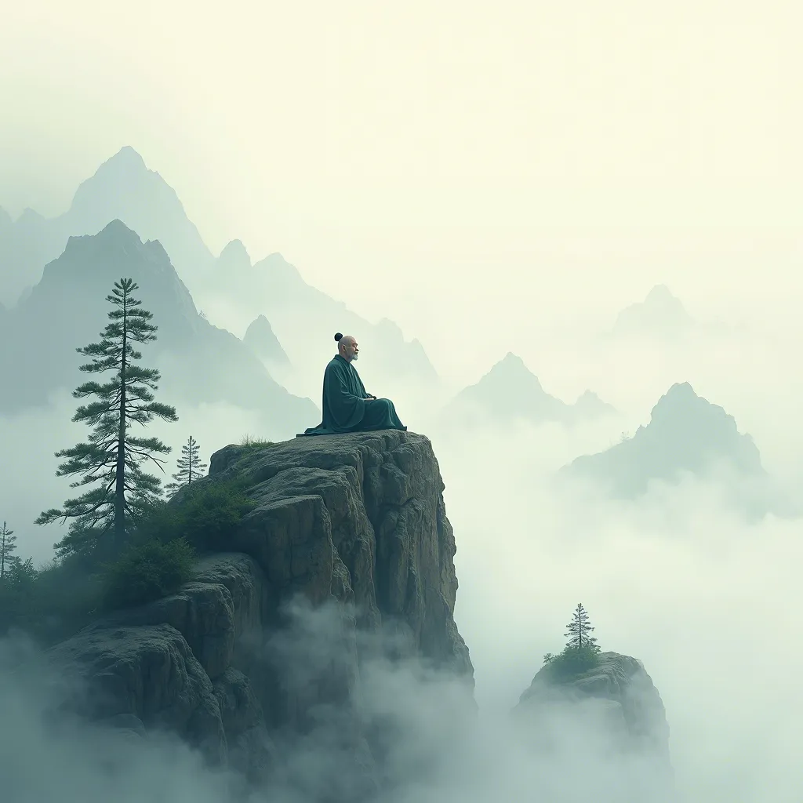

```
无为，是道家哲学中的一朵奇葩，
它教导我们，
有时候，最好的行动就是不行动。
就像一位智者静坐于山巅，
任由世界风云变幻，
他自岿然不动。
无为不是懒惰，
不是无所作为，
而是在恰当的时机，
以静制动，
以无为而无不为。
它是一种深谋远虑的策略，
一种超越平庸的智慧，
一种在混沌中寻找秩序的艺术。
```


> 无我，是一种哲学上的境界，
> 
> 它不是简单的自我否定，
> 
> 而是一种超越个体自我，
> 
> 达到与宇宙万物合一的精神状态。
> 
> 在佛教中，
> 
> 无我是指一切事物都没有独立的、实在的自体，
> 
> 即没有一个常住、独立、自在、主宰的“自我”（灵魂）的存在。
> 
> 它教导我们，
> 
> 所谓的“我”不过是五蕴（色、受、想、行、识）的暂时集合，
> 
> 每一刻都在变化，
> 
> 没有永恒不变的实体。
> 
> 在道家哲学中，
> 
> “无我”则体现为“圣人常无心，以百姓心为心”的境界，
> 
> 是一种摒弃自我执念、
> 
> 追求物我相忘的自由状态。
> 
> 无我，不是消失，
> 
> 而是在更广阔的天地间找到自我的位置，
> 
> 是一种放下小我，成就大我的智慧。
