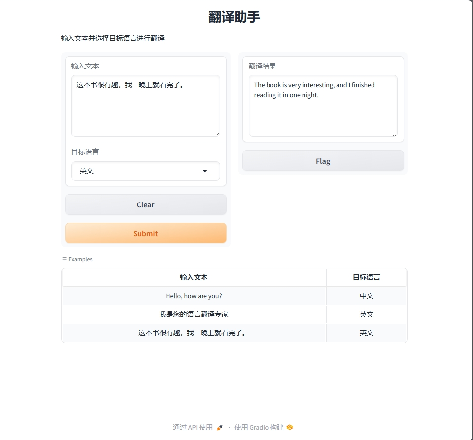

## OpenAI Translator配合Ollama和gradio进行本地翻译



要使用 Ollama 进行本地翻译，您需要确保您使用的模型具备翻译能力。以下是使用 OpenAI Translator 配合 Ollama 进行本地翻译的步骤：

1. **安装 Ollama**：
   
   - 访问 Ollama 的官方网站下载适合您操作系统的安装包并安装。

2. **启动 Ollama 服务**：
   
   - 运行 Ollama 并确保它正在后台运行。

3. **获取翻译模型**：
   
   - 使用 Ollama 的命令行工具来获取一个支持翻译的模型。例如，使用命令 `ollama pull qwen2.5` 获取 qween2.5模型。

4. **配置环境变量**（如果需要）：
   
   - 如果您需要更改 Ollama API 的默认端口或允许跨域请求，您可以通过设置环境变量来实现。

5. **使用 OpenAI Translator**：
   
   - 在 OpenAI Translator 中配置 Ollama API。将 API 地址设置为 `http://localhost:11434` 或您自定义的端口。
   - 使用 OpenAI 的客户端库连接到 Ollama。以下是一个 Python 示例代码，它使用 Ollama 进行翻译：

```app.py
import gradio as gr
from openai import OpenAI

# 配置 Ollama API
client = OpenAI(
    base_url='http://localhost:11434/v1',
    api_key='ollama',  # Ollama 不使用 API 密钥，这只是一个参数
)

def translate_text(text, target_language):
    # 发送翻译请求
    response = client.chat.completions.create(
        model="qwen2.5",  # 使用 Llama 模型
        messages=[
            {"role": "system", "content": f"""You are a Translation Expert. Translate the following text to {target_language}.Please do not explain or anwser
            the question,just translate.Please deliver clear and accurate translated texts."""},
            {"role": "user", "content": text}
        ]
    )
    # 返回翻译结果
    return response.choices[0].message.content

# 创建 Gradio 界面
iface = gr.Interface(
    fn=translate_text,
    inputs=[
        gr.Textbox(lines=5, placeholder="输入要翻译的文本", label="输入文本"),
        gr.Dropdown(choices=["中文", "英文", "法文", "西班牙文"], label="目标语言",value="英文")
    ],
    outputs=gr.Textbox(lines=5, label="翻译结果"),
    title="翻译助手",
    description="输入文本并选择目标语言进行翻译",
    examples=[["Hello, how are you?", "中文"],["我是您的语言翻译专家", "英文"],["这本书很有趣，我一晚上就看完了。", "英文"]]
)

# 启动 Gradio 界面，并在默认浏览器中自动打开
iface.launch(inbrowser=True)
```

6. **测试翻译**：
   
   ```
   cmd /k E:\virtualenv\cpu\Scripts\python app.py
   ```
   
   - 运行上述代码，如果一切配置正确，您应该可以打开web浏览器进行翻译了。

请注意，您需要确保使用的模型支持翻译任务。qwen2.5是一个示例模型，您可能需要根据实际情况选择其他合适的模型。此外，您可能需要调整 `base_url` 和 `model` 参数以匹配您的 Ollama 配置和模型。
