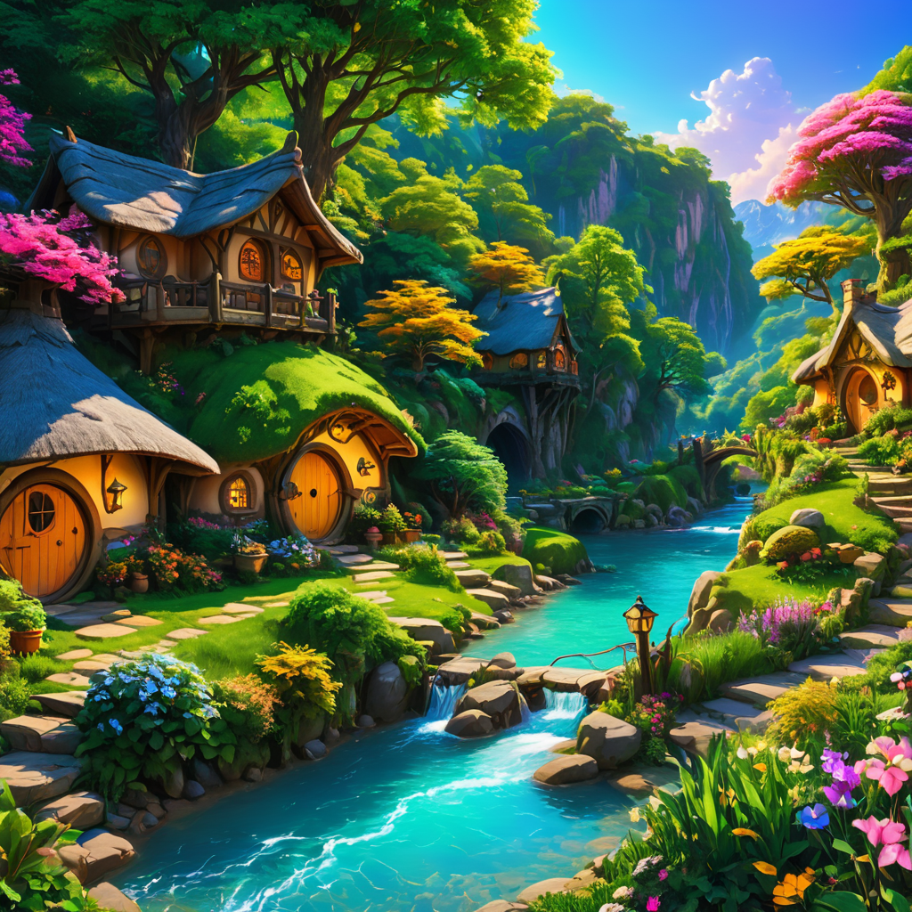

## 《静思之秋》

在这宁静的秋天，

我坐在时间的边缘，

 闭上眼，深呼吸， 

让心灵在静谧中旅行。

叶子轻轻地落下， 

像蝴蝶在空中飘舞， 

它们告诉我，

生命的故事， 在每一次的坠落中升华。

风，轻轻地吹过， 

带着远方的低语，

每一颗心都有翅膀， 

在冥想中自由飞翔。

我听见，内心深处的声音，

放下，放下， 

让所有的烦恼随风而去， 

在秋天的怀抱中找到安定。

我看见，

蓝色的天空中， 云朵在悠闲地流浪， 

仿佛提醒我，

世界如此广阔， 放下才能自在。

在这清冷的秋天， 

我学会了倾听， 

听那无声的语言， 

在宁静中，渐渐与自己和解。

秋天，是收获的季节，

 也是沉思的时刻， 

在这个季节里， 

我寻找到了心灵的家园。
