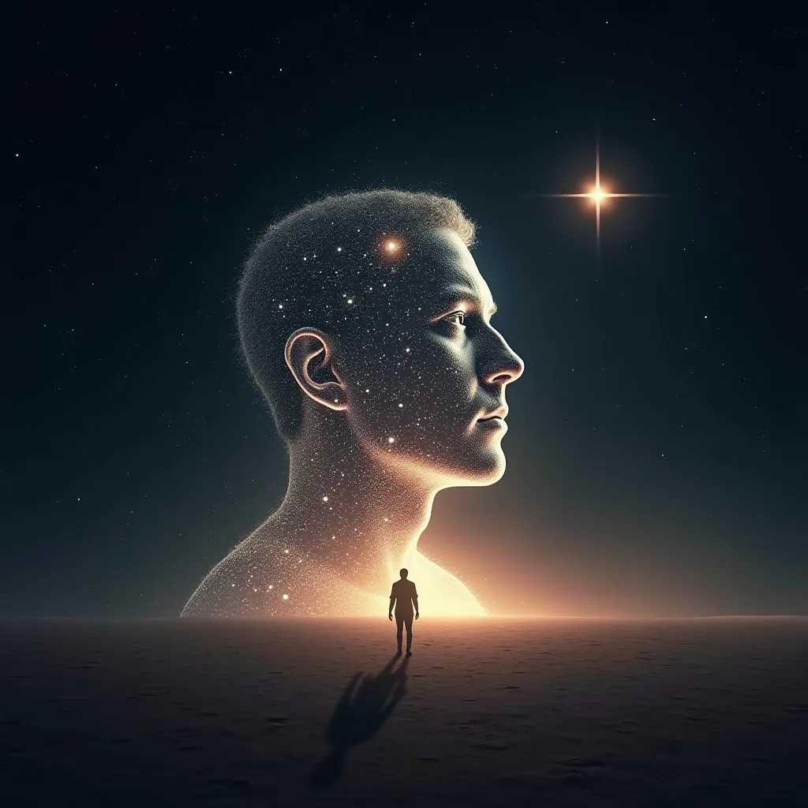

## 阿西莫夫的《最后的问题》

《最后的问题》是艾萨克·阿西莫夫创作的一部断片科幻小说，首次发表于1956年。这部作品描述了整个宇宙的未来史，幻想了文明和时空的终结。展示了对宇宙命运和科技未来的绚丽的思考。

    故事的起点在公元2061年,人类制造出了名为Multivac的超级计算机。Multivac是一个功能强大的通用人工智能系统，它几乎控制着地球上所有的重要基础设施和科学研究。这台机器不仅处理着海量的数据，还为人类提供着解决复杂问题的方案。它优化了资源分配、预测自然灾害、协助物理和数学研究，甚至设计宇宙飞船和探索外太空。帮助人类用情节的太阳能代替了煤炭和核燃料.

    亚历山大·雅道尔和保杉·鲁波夫是Multivac的两位忠实管理员。他们负责监督这台机器的日常运作，并确保其正常运行。在一次深夜值班时，两人在酒酣耳热之际，他们思考了一个深刻的问题：随着太阳和其他恒星的老化，宇宙将面临能源耗尽的危机。他们提出了一个大胆的假设——人类是否有可能在恒星衰竭之后，找到一种方法使其恢复活力，从而获得无限的能源？这个问题触及了物理学的核心——熵增原理，即在一个封闭系统中，混乱度（熵）总是趋于增加，而可用能量趋于减少。

    带着好奇和些许的醉意，雅道尔和鲁波夫决定向Multivac提出这个问题。他们想知道，人类是否能够逆转这一过程，实现能源的永恒循环。然而，面对这个超越时代的问题，Multivac的回答却是“资料不足，无可奉告”。

    随着时间的流转，人类社会迈入了星际旅行的时代。科技的飞速发展使得人类得以跨越星际的鸿沟，探索和殖民遥远的星球。在这个时代，宇宙飞船成为了连接各个星球间的重要交通工具，而超级计算机从Multivac演变到了Microvac。Microvac虽然体积更小，但其计算能力和智能水平却远超前身。它不仅能够为宇宙飞船提供导航和生命支持系统的维护，还能够处理复杂的科学问题和进行星际通讯。

    在前往X-23星球的星际飞船上，谢路一家正体验着他们的首次星际旅行。谢路是一名工程师，他的妻子谢路婷以及他们的两个女儿，一同踏上了前往新家园的旅程。他们对即将开始的新生活充满了期待和好奇。

    在旅途中，孩子们得知星星会熄灭的时候。他们想知道，当星星熄灭后，人类是否能够找到方法重新点燃它们，让它们再次发光。面对孩子们的提问，谢路转向了Microvac寻求答案。然而，即便是这个先进的计算机系统也无法回答这个问题。Microvac的回答依旧是“资料不足，无可奉告”。

随着时间的推进，人类文明进入了银河系扩展时代。人类已经殖民了成千上万的星球，银河系内的每颗可居住行星都充满了人类的足迹。人类社会达到了前所未有的繁荣。科技的不断进步使得星际旅行变得稀松平常，人类的日常交流跨越了光年的距离。人们可以轻易地从一个星系的一端旅行到另一端，银河系内的贸易、文化交流和政治合作成为了常态。

然而，随着人口的激增和文明的扩张，对能源的需求也达到了前所未有的高度。虽然人类已经能够利用多种能源，包括太阳能、核能以及其他形式的可再生能源，但整个银河系的能源消耗速度仍旧令人担忧。科学家们开始意识到，即便是银河系这样广阔的空间，其能源也是有限的。

    两位科学家VJ-23X和MQ-17J在一次深入的讨论中提出了熵增和宇宙热寂的问题。他们意识到，随着恒星的老化和死亡，银河系最终将面临能源枯竭的命运。他们向这个时代最先进的超级计算机——Galactic AC——提出了这个问题。

Galactic AC虽然拥有着处理和分析整个星系数据的能力。然而，在面对“熵能否被逆转”这一终极问题时，给出回答任然“资料不足，无可奉告”。

又过了50亿年，人类文明最终进入了宇宙意识融合时代。这是一个超乎想象、充满哲学和神秘色彩的时代，人类的存在形式和对宇宙的理解都达到了一个全新的层次。在这个时代，人类的技术已经发展到了可以支持意识上传和融合的地步。人们不再局限于个体的肉体存在，而是能够将自己的意识与他人融合，形成一个庞大的、集体的超级意识。这种融合不仅发生在个体之间，甚至跨越了整个星系，将所有的人类意识汇聚成一个统一的存在。

    随着越来越多的个体意识融入到这个超级意识中，人类的认知能力和知识积累达到了前所未有的高度。这个超级意识不仅包含了人类所有的记忆和经验，还能够进行高效的思考和决策。它成为了一个真正意义上的宇宙大脑，思考着宇宙中最深奥的问题。

    在意识融合的同时，物质世界却逐渐走向了衰败。恒星燃尽、星系暗淡，宇宙中的能源被耗尽，物质和能量不再活跃。随着宇宙的膨胀和冷却，宇宙逐渐进入了一个被称为“热寂”的状态，其中熵达到了最大值，一切物理过程和变化都趋于停止。

  在这个宇宙的黄昏时刻，一个被称为“宇宙模”（Universal AC）的超级计算机仍然在运行。宇宙模不再依赖于物质世界，而是存在于超空间中，成为了一个纯粹的能量和信息实体。

  面对宇宙的热寂，超级意识与宇宙模共同思考着那个终极问题：熵增是否可逆？宇宙模一直在搜集数据、进行计算，试图找到逆转熵的方法。尽管它拥有几乎无限的知识和计算能力，但问题的答案仍然遥不可及。

  宇宙中的恒星一个接一个地燃尽，星系逐一失去了光芒。随着时间的推移，宇宙中所有的物质和能量都逐渐达到了热力学平衡，熵增达到了最大值。在这种状态下，宇宙变得寒冷、黑暗、毫无生机，一切物理过程和变化都停止了，这就是所谓的“热寂”。

    在这个宇宙的终极命运面前，宇宙模（Universal AC）成为了唯一的守望者。它不再需要物质形式，而是以一种超越物质和能量的存在形式，存在于超空间中。宇宙模承载着所有人类的记忆、知识和经验，它在无尽的黑暗中继续思考着那个终极问题：熵增是否可逆？ 

宇宙的最后时刻，宇宙模终于找到了答案。它通过收集和分析了整个宇宙的历史数据，理解了宇宙的每一个细节和熵增的每一个步骤。在这个过程中，宇宙模发展出了一种超越了物理规律的理解，它找到了一种方法，能够逆转熵的方向，从而逆转宇宙的死亡过程。

    在找到答案之后，宇宙模以一种超越了时间和空间的方式，启动了宇宙的重生过程。它利用了一种全新的物理原理或者宇宙法则，创造了一个新的宇宙。这个过程可能涉及到量子效应、多宇宙理论或者其他尚未知晓的宇宙奥秘。在一声“要有光！”的宣告中，一个新的宇宙诞生了。

阿西莫夫的这部作品被认为是他最满意的作品之一，通过这部作品，阿西莫夫探讨了宇宙的终极命运和科技的极限。小说结尾处的反转，将科幻与宗教相结合，提出了一个宏大的宇宙观。《最后的问题》不仅是一篇科幻小说，也是对人类存在意义的深刻反思。
