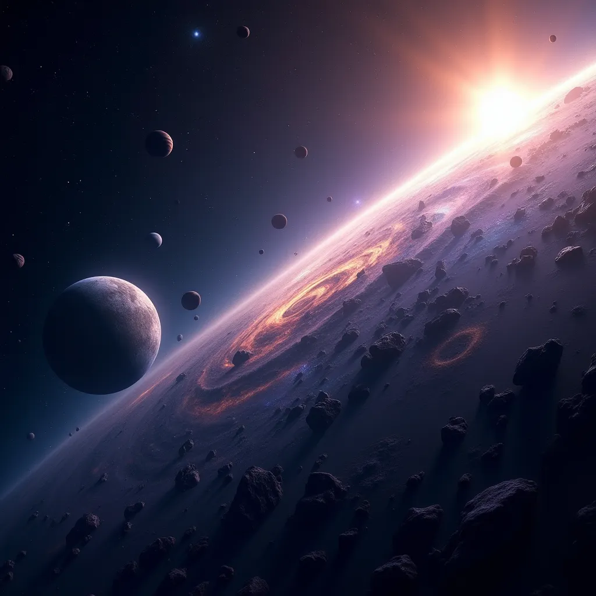
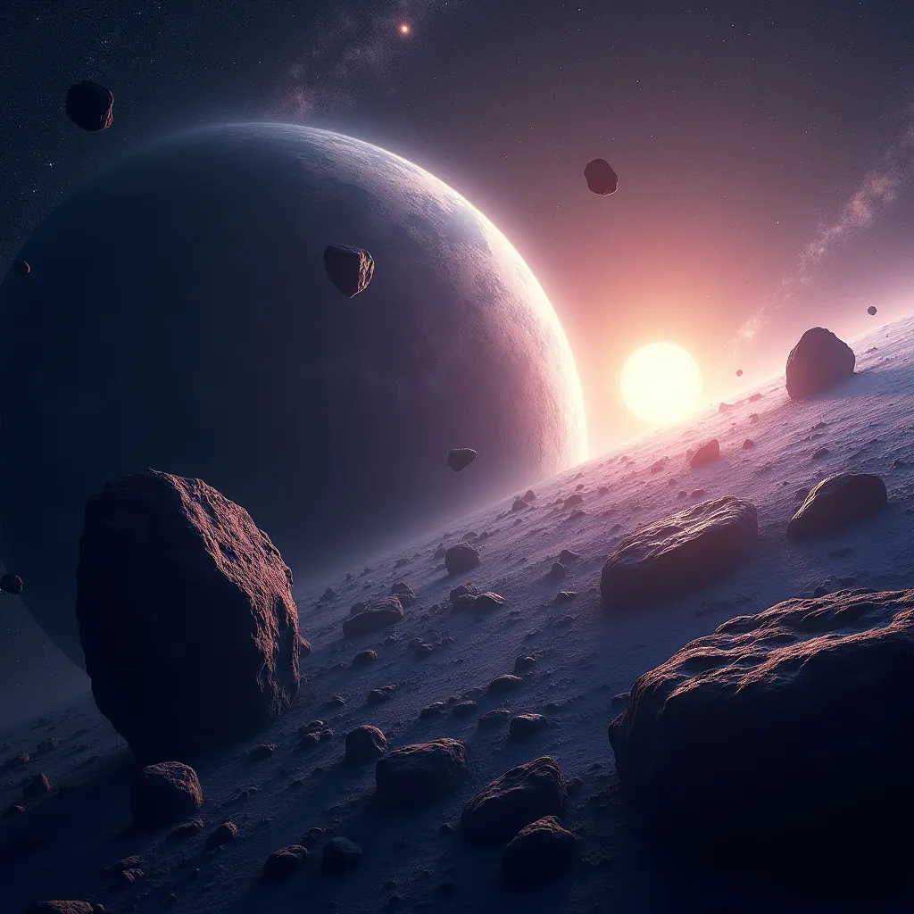

## 太阳系的小行星带

    

    小行星带是位于火星和木星轨道之间的区域，它包含了太阳系中大多数的小行星。这个区域有时也被称为主小行星带，以区别于柯伊伯带。小行星带中最大的天体是矮行星谷神星，直径约为950公里，此外还有智神星、婚神星和灶神星等较大的小行星。

    小行星带的形成原因，现代研究认为可能是因为木星的引力影响阻止了小行星聚集成行星，导致它们发生了碰撞和碎片化。因此，小行星带中的物质非常稀薄，已经有好几艘太空船安全通过而未曾发生意外。

    小行星带中的小行星依照它们的光谱和主要形式分成三类：碳质、硅酸盐和金属。其中，C型或碳质小行星是最常见的类型，占总数的75%以上。S型或硅酸盐小行星较为常见于小行星带的内侧部分，而M型或金属小行星则含有类似铁-镍的谱线。

    小行星带并不是一个拥挤的地方，两颗小行星之间的平均间距约为一百万公里。此外，小行星带中的小行星分布并不均匀，存在一些被称为柯克伍德空隙的区域，在木星的引力影响下清除了小行星。

    小行星带中最大的天体是谷神星，其次是灶神星、智神星和健神星。这些天体约占整个小行星带质量的一半。谷神星是唯一一个大到足以保持球形的天体，而大多数小行星看起来像土豆，但其中一些形状更不寻常。

    小行星带的探索历史包括先驱者10号、伽利略号和黎明号等探测器的访问。先驱者10号于1972年飞越了小行星带，而黎明号探测器则访问了灶神星和谷神星。

    小行星带中的小行星如果因为引力扰动或其他原因改变轨道，极少数情况下可能会与地球相撞。虽然发生的概率极低，但一旦发生，将会对地球造成灾难性的影响。

    约6500万年前，一颗直径约10公里的小行星撞击了现在墨西哥的尤卡坦半岛，形成了希克苏鲁伯撞击坑。这次撞击事件导致了包括恐龙在内的全球超过70%的生物灭绝，标志着白垩纪的结束和新生代的开始。

    1908年6月30日，一颗小行星在俄罗斯西伯利亚通古斯河上空爆炸，爆炸威力相当于2千万吨TNT炸药。这次爆炸造成了超过2150平方公里内的8千万棵树焚毁倒下，但没有发现任何陨石坑，科学家推测撞击体在大气层中爆炸解体。

    科学家们正在研究各种方法来偏转或摧毁可能对地球构成威胁的小行星，包括核爆炸、动能撞击、激光烧蚀等技术。

    一些科学家和商业公司对小行星的矿产资源感兴趣，认为它们可以作为太空中的“矿山”。小行星上可能含有铁、镍、贵金属等工业材料，甚至可能有水和有机化合物，这些都是未来太空探索和资源利用的潜在目标。

     小行星带是太阳系中一个非常有趣和重要的区域，它可能记录了太阳系早期形成的历史，并且对研究太阳系的起源和演化提供了重要的线索。
